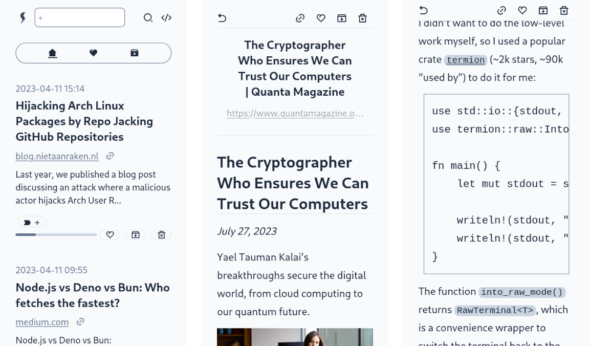

<h1>leaf</h1>

Self-hostable "read-it-later" Web app.

<hr />



<hr />

## What is this exactly

- Save a web page by URL and read its content later.
- Save your progress automatically.
- Features:
  - like
  - archive
  - tagging
  - full-text search by `ripgrep`
- Via the client API, or the
  [Firefox extension](https://addons.mozilla.org/en-US/firefox/addon/leaf-extension/),
  you can easily add new articles.

## New release

### v0.7.0
- Use `ripgrep` instead of `tantivy` (search engine).
  - To migrate from v0.6.3 or before, send a POST reguest to client's `/api/migrate`, which will make index files in your `databases` directory.
- Add menu link to download JSON file that contains information of stored articles.
- Fix minor bugs and styles.

### v0.6.3 (2023-08-26)
- Show proper error message when creating new article fails.

## Deploy

1. Prepare 2 files and 1 empty directory: `docker-compose.yml`, `.env.production` and `databases`.  
`databases` directory will have `.index` directory (to store the search index) and `.sqlite` binary, both of which will be automatically created.

`docker-compose.yml` example
```
version: "3"
services:
  server:
    image: docker.io/kyoheiudev/leaf-server:0.7.0
    container_name: leaf-server
    volumes:
      - /path/to/databases:/var/leaf/databases
      - /etc/localtime:/etc/localtime:ro
    ports:
      - 8000:8000
  client:
    image: docker.io/kyoheiudev/leaf-client:0.7.0
    container_name: leaf-client
    volumes:
      - /path/to/.env.production:/app/.env.production
```

`.env.production` example
```
NEXT_PUBLIC_HOST=leaf-server
LEAF_API_TOKEN=WHICH_YOU_USE_WHEN_POST_NEW_ONE_VIA_EXTENSION
```

You should edit `LEAF_API_TOKEN`.

By default this app is not protected by any means so that you can use your own auth process.

2. `docker compose up -d` and the app will start listening on port 3000.

## API   
Via the client API you can add new article:

```http
POST /api/create
Content-Type: application/json
Authorization: LEAF_API_TOKEN

{
  "url": "https://example.com"
}
```

## Architecture


### Tech stack

- TypeScript as the frontend
  - Next.js
  - puppeteer to get contents
  - mozilla/readability
  - tailwindcss
- Rust as the backend
  - axum
  - ammonia as the sanitizer
  - ripgrep as the full-text search tool
- SQLite as the database

## Dev

### dev-prerequisites

- nodejs (front end)
- cargo (back end)
- make

Add `.env.development.local` to the `client` directory with the following:

```
NEXT_PUBLIC_HOST=127.0.0.1
LEAF_API_TOKEN=test
```

And in the root directory:

```
cd client && npm install
cd .. && make -i dev
```

Then you can see the page on `localhost:3000`.

