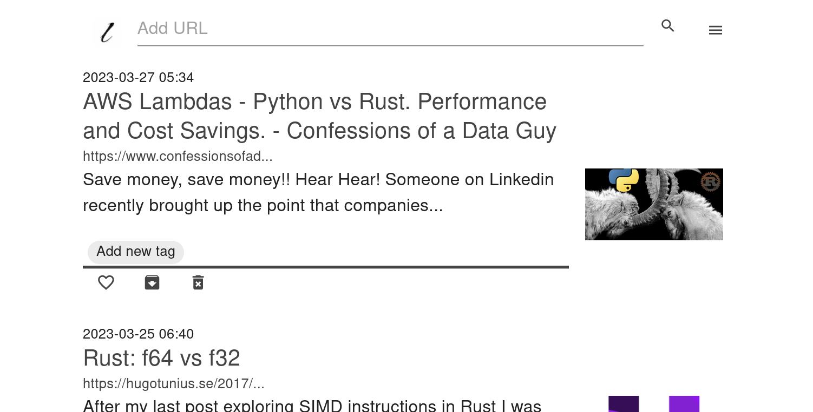
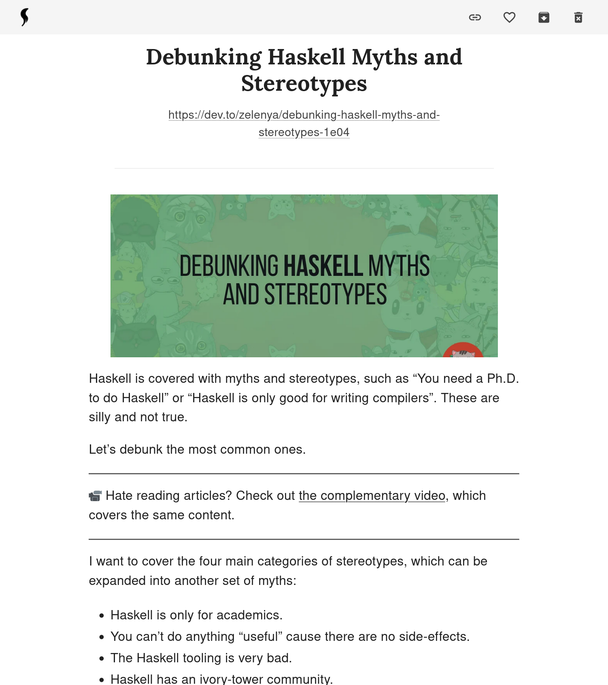

<h1>leaf</h1>

Instapaper is great, but you can self-host your own "read-later" Web app.


<hr />



<hr />



<hr />

## What is this exactly

- Save a web page by URL and read only its content later.
- Specialized to "read": Use leaf to read text-based articles.
- Save your progress automatically.
- Features:
  - like
  - archive
  - tagging
  - full-text search (works only with languages based on the Latin script for
    now)
  - light/dark theme
  - built-in auth
- With the
  [Firefox extension](https://addons.mozilla.org/en-US/firefox/addon/leaf-extension/),
  you can easily add new article.

## Install to your server

1. After `git clone` this repo, add `.env.production` in the `client` directory
   with the following contents:

```
NEXTAUTH_URL=https://your-site.url
NEXT_PUBLIC_TITLE=leaf
NEXT_PUBLIC_HOST=server
NEXTAUTH_SECRET=RANDOM_STRING_TO_BE_USED_WHEN_HASHING_THINGS
CREDENTIALS_ID=YOUR_ID
CREDENTIALS_PASSWORD=SO_STRONG_PASSWORD
WEB_API_TOKEN=WHICH_YOU_USE_WHEN_POST_NEW_ONE_VIA_EXTENSION
```

You should edit `NEXTAUTH_SECRET`, `CREDENTIALS_ID`, `CREDENTIALS_PASSWORD` and
`WEB_API_TOKEN`.

_You can add `GITHUB_CLIENT_ID` and `GITHUB_CLIENT_SECRET` to this file to make
it more secured with 2FA._

2. `make run` in the root directory,and the Next.js client will begin listening
   on port 3000.

## Update

```
make down
git pull
make run
```

## Architecture


### Tech stack

- TypeScript as the frontend
  - Next.js
  - Auth.js
  - MUI
- Rust as the backend
  - axum
  - headless-chrome to get contents
  - customized content extractor based on mozilla/readability (WIP)
  - ammonia as the sanitizer
  - tantivy as the full-text search engine
- SQLite as the database

## Dev

### dev-prerequisites

- docker
- nodejs, cargo, make
- (optional) GitHub Account and its auth secret

Add `.env.development.local` to the `client` directory with the following:

```
NEXTAUTH_URL=http://localhost:3000
NEXT_PUBLIC_TITLE=leaf
NEXT_PUBLIC_HOST=127.0.0.1
NEXTAUTH_SECRET=RANDOM_STRING_TO_BE_USED_WHEN_HASHING_THINGS
CREDENTIALS_ID=test
CREDENTIALS_PASSWORD=test
GITHUB_CLIENT_ID=GITHUB_AUTH_CLIENT_ID
GITHUB_CLIENT_SECRET=GITHUB_AUTH_CLIENT_SECRET
WEB_API_TOKEN=test
```

And in the root directory:

```
make -i dev
```

Then you can see the page on `localhost:3000`.
