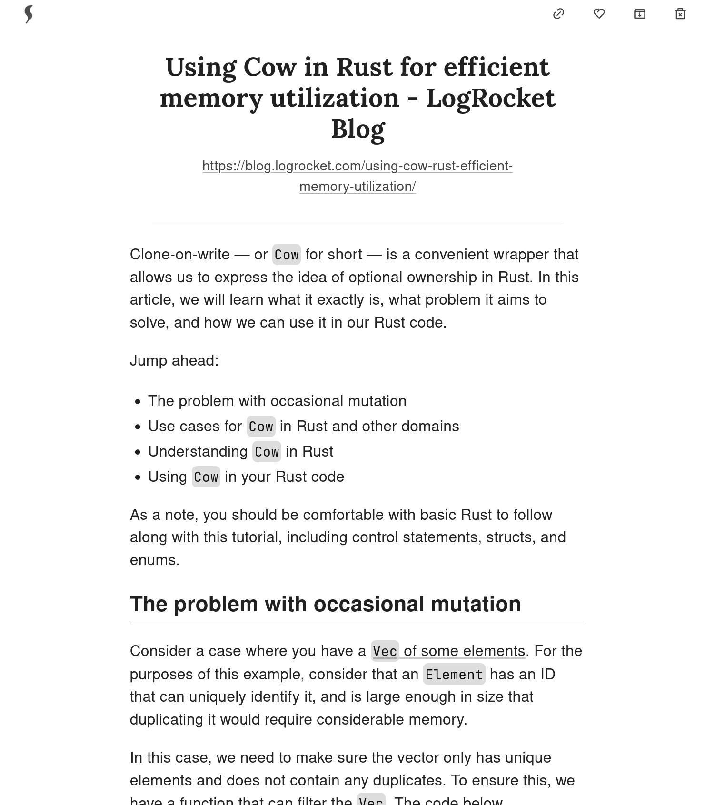

<h1>leaf</h1>

Instapaper is great, but you can self-host your own "read-later" Web app.


<hr />




<hr />

## What is this exactly

- Save a web page by URL and read only its content later.
- Specialized to "read": Use leaf to read text-based articles.
- Save your progress automatically.
- Features:
  - like
  - archive
  - tagging
  - full-text search (works only with languages based on the Latin script for
    now)
  - light/dark theme
  - built-in auth (Optional: Requires GitHub account)
- With the
  [Firefox extension](https://addons.mozilla.org/en-US/firefox/addon/leaf-extension/),
  you can easily add new articles.

## New release

### v0.4.2 (2023-05-20)
- Add link to download data as JSON file.

### v0.4.1 (2023-05-16)
- Fix content extractor bug: Check if top_candidate's parent exists.

## Deploy

1. You just need 2 files: `docker-compose.yml` and `.env.production`.

`docker-compose.yml` example
```
version: "3"
services:
  server:
    image: docker.io/kyoheiudev/leaf-server:0.4.2
    container_name: leaf-server
    volumes:
      - ./server/databases:/var/leaf/databases
      - /etc/localtime:/etc/localtime:ro
    ports:
      - 8000:8000
  client:
    image: docker.io/kyoheiudev/leaf-client:0.4.2
    container_name: leaf-client
    volumes:
      - ./path/to/.env.production:/app/.env.production
    ports:
      - 3000:3000
```

`.env.production` example
```
NEXT_PUBLIC_TITLE=leaf
NEXT_PUBLIC_HOST=leaf-server
NEXTAUTH_URL=https://your-site.url
NEXTAUTH_SECRET=RANDOM_STRING_TO_BE_USED_WHEN_HASHING_THINGS
WEB_API_TOKEN=WHICH_YOU_USE_WHEN_POST_NEW_ONE_VIA_EXTENSION
```

You should edit `NEXTAUTH_URL`, `NEXTAUTH_SECRET`, and
`WEB_API_TOKEN`.

By default this app is not protected by any means so that you can use your own auth process like SSO. If you want the built-in authentication, add `GITHUB_CLIENT_ID` and `GITHUB_CLIENT_SECRET` to this file. For more details, please see [this GitHub document](https://docs.github.com/en/apps/oauth-apps/building-oauth-apps/creating-an-oauth-app)._

2. `docker compose up -d` and the app will start listening on port 3000.
   (The SQLite database and search index are created in the directory described in your `docker-compose.yml`)

## Architecture


### Tech stack

- TypeScript as the frontend
  - Next.js
  - Auth.js
  - MUI
- Rust as the backend
  - axum
  - headless-chrome to get contents
  - customized content extractor based on mozilla/readability
  - ammonia as the sanitizer
  - tantivy as the full-text search engine
- SQLite as the database

## Dev

### dev-prerequisites

- docker
- nodejs, cargo, make
- (optional) GitHub Account

Add `.env.development.local` to the `client` directory with the following:

```
NEXT_PUBLIC_TITLE=leaf
NEXT_PUBLIC_HOST=127.0.0.1
NEXTAUTH_URL=http://localhost:3000
NEXTAUTH_SECRET=RANDOM_STRING_TO_BE_USED_WHEN_HASHING_THINGS
WEB_API_TOKEN=test
```

And in the root directory:

```
cd client && yarn install
cd .. && make -i dev
```

Then you can see the page on `localhost:3000`.

## Report bug / Request features / Contribute
This repository is maintained on [https://git.sr.ht/~kyoheiu/leaf](https://git.sr.ht/~kyoheiu/leaf).
Contact me via email: ~kyoheiu/leaf@lists.sr.ht

## TODO

- Import?
