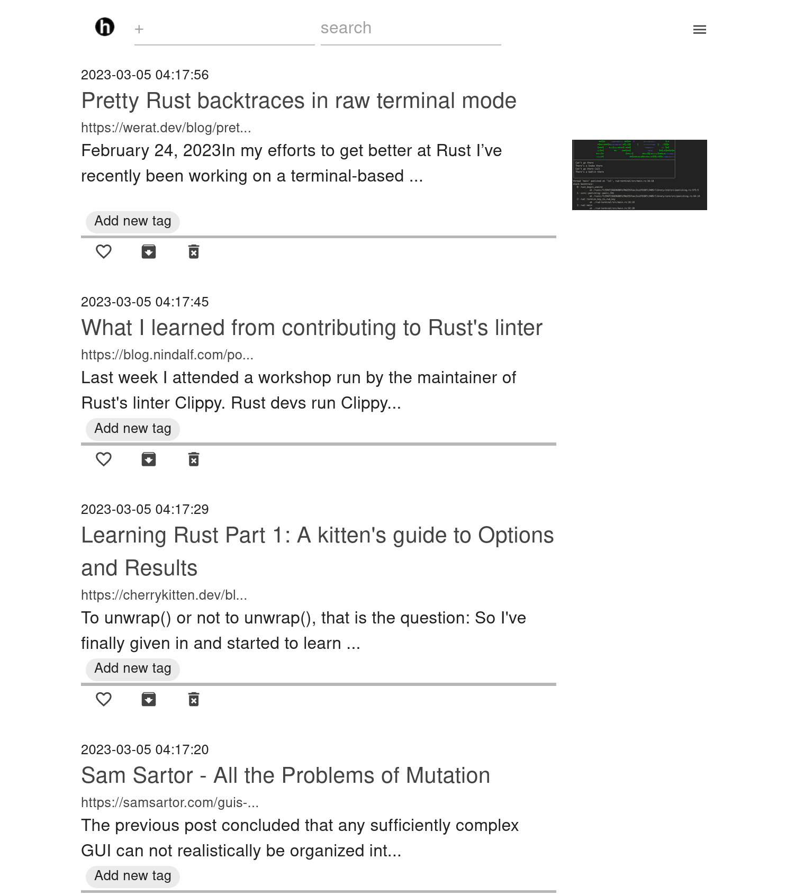
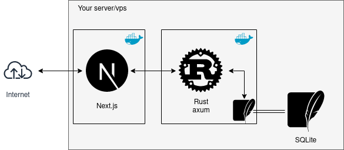

Self-hostable Instapaper-ish document managing app.
Heavily WIP, do not touch!



## diagram


### tech stack
- Next.js as the frontend
  - MUI
  - puppeteer
  - Auth.js (using GitHub account)
  - Typescript
- Rust as the backend
  - axum
  - tantivy as the full-text search engine
- SQLite as the database

## prerequisites
- docker
- GitHub Account and its auth secret

## Dev
Add `.env.development.local` to the `client` directory with the following:
```
NEXTAUTH_URL=http://localhost:3000
NEXT_PUBLIC_TITLE=hmstr
NEXT_PUBLIC_HOST=127.0.0.1
NEXTAUTH_SECRET=RANDOM_STRING_TO_BE_USED_WHEN_HASHING_THINGS
GITHUB_CLIENT_ID=GITHUB_AUTH_CLIENT_ID
GITHUB_CLIENT_SECRET=GITHUB_AUTH_CLIENT_SECRET
```

And in the root directory:
```
make dev 
```
Then you can see the page on `localhost:3000`.

## deploy
1. After `git clone` this repo, add `.env.production` to the `client` directory, which contains the following:
```
NEXTAUTH_URL=https://example.com
NEXT_PUBLIC_TITLE=hmstr
NEXT_PUBLIC_HOST=server
NEXTAUTH_SECRET=RANDOM_STRING_TO_BE_USED_WHEN_HASHING_THINGS
GITHUB_CLIENT_ID=GITHUB_AUTH_CLIENT_ID
GITHUB_CLIENT_SECRET=GITHUB_AUTH_SECRET
```
2. `make run` and the Next.js client will begin listening on port 3000.
